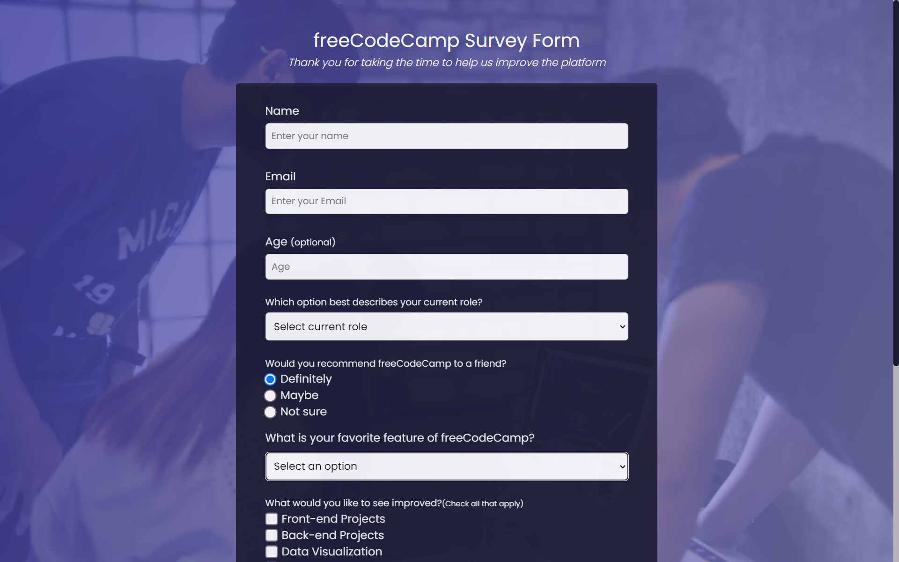

# freeCodeCamp Survey Form

This is a simple survey form created as part of a project for freeCodeCamp. The survey form is designed to collect feedback from users and understand their preferences related to freeCodeCamp's features and services. 
link to the website : https://ahmedhanye.github.io/freeCodeCamp-Survey-Form/

## Table of Contents
- [Features](#features)
- [Usage](#usage)
- [Contributing](#contributing)
- [License](#license)

## Features

- Collects user feedback about freeCodeCamp.
- Asks for user's name, email, age, current role, favorite feature, and more.
- Provides checkboxes for selecting multiple improvement suggestions.
- Allows users to leave comments or suggestions.
- Designed with accessibility in mind, including labels and autocomplete attributes for form fields.

## Usage

To use the survey form, simply open the `index.html` file in a web browser. Users can fill out the form by entering their information and selecting options that best describe their preferences and suggestions. Once the form is completed, users can submit their responses.

## Contributing

Contributions are welcome! If you would like to contribute to this project, please follow these steps:

1. Fork the repository.
2. Create a new branch for your feature or bug fix.
3. Make your changes and test them thoroughly.
4. Submit a pull request explaining the changes you've made.

## License
This project is licensed under the [MIT License](LICENSE). Feel free to use, modify, and distribute this code for your own projects.

---

Happy coding!
